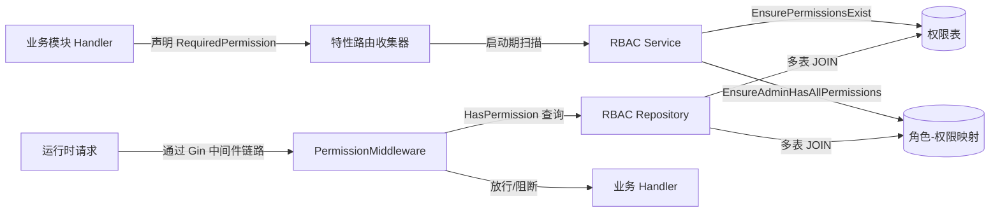
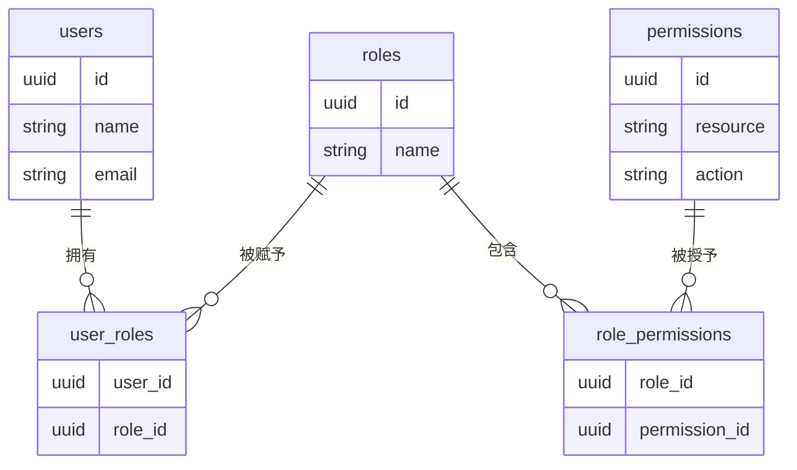
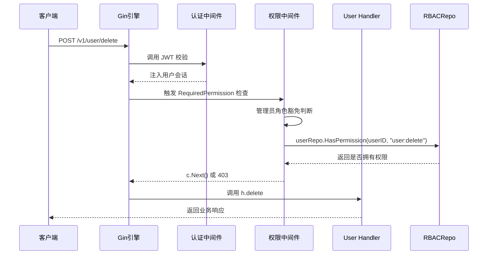

# 可插拔式高级 RBAC 系统保姆级指南

本脚手架内置两套权限体系：

1. **默认的简单三层守卫模式** —— 仅依赖基础的公共、登录、管理员路由守卫。
2. **可选的高级 RBAC 插件模式** —— 在保持脚手架轻量的同时，引入动态的权限模型和自动化注册流程。

本文档的目标是**专注讲透“高级 RBAC 插件模式”**，帮助你从零理解它的运行原理。整套设计秉持两大核心哲学：

- **代码即文档，声明即注册**：开发者只需在路由定义上“声明”所需的权限，系统会自动完成后续的发现、注册、同步。
- **约定优于配置**：统一的命名约定和常量定义确保团队协作时无需重复配置，降低心智负担。

为了便于整体理解，先来看一张总览图：



---

## 第一章：基石 - 用户、角色、权限三大模型

### 1.1 模型关系综述

在高级 RBAC 模式下，权限控制围绕三大核心概念展开：

- **用户（User）**：登录系统的主体，可以拥有多个角色。
- **角色（Role）**：权限的组合包，适用于某类用户。
- **权限（Permission）**：对某个资源（Resource）执行某种动作（Action）的能力。

关系可以简单概括为：

> 用户 ←→ 角色 ←→ 权限

用户与角色、角色与权限之间都是“多对多”关系，分别通过 `user_roles`、`role_permissions` 中间表维护。

### 1.2 核心 GORM 结构体

以下是三个核心结构体在代码中的真实定义：

```go
// internal/user/model.go
// User 用户实体
type User struct {
    ID           uuid.UUID    `gorm:"type:uuid;primaryKey"`
    Name         string       `gorm:"size:255"`
    Email        string       `gorm:"size:255;uniqueIndex"`
    PasswordHash string       `gorm:"column:password_hash"`
    Phone        string       `gorm:"size:64"`
    Roles        []*rbac.Role `gorm:"many2many:user_roles;constraint:OnUpdate:CASCADE,OnDelete:SET NULL;"`
    model.Base
}
```

```go
// internal/rbac/model.go
// Role groups permissions and can be attached to a user.
type Role struct {
    ID          uuid.UUID     `gorm:"type:uuid;primaryKey"`
    Name        string        `gorm:"size:255;uniqueIndex"`
    Description string        `gorm:"size:512"`
    Permissions []*Permission `gorm:"many2many:role_permissions;constraint:OnUpdate:CASCADE,OnDelete:CASCADE;"`
    model.Base
}
```

```go
// internal/rbac/model.go
// Permission represents an action that can be executed on a specific resource.
type Permission struct {
    ID          uuid.UUID `gorm:"type:uuid;primaryKey"`
    Resource    string    `gorm:"size:255;index:idx_permissions_resource_action,unique"`
    Action      string    `gorm:"size:255;index:idx_permissions_resource_action,unique"`
    Description string    `gorm:"size:512"`
    model.Base
}
```

### 1.3 实体关系图

借助 Mermaid 绘制出的 ER 图能直观展示五张表之间的联系：



---

## 第二章：一个权限的诞生、注册与执行

这一章我们用“API 请求的生命周期”串起全部流程，示例接口选取 `POST /v1/user/delete`。

### 步骤 1：声明（The Declaration）

开发者在 `internal/user/handler.go` 中声明路由时，只需指出所需权限：

```go
// internal/user/handler.go
func (h *Handler) GetRoutes() feature.ModuleRoutes {
    return feature.ModuleRoutes{
        AuthenticatedRoutes: []feature.RouteDefinition{
            {Path: "delete", Handler: h.delete, RequiredPermission: rbac.PermissionKey(rbac.ResourceUser, rbac.ActionDelete)},
        },
    }
}
```

关键行 `RequiredPermission: rbac.PermissionKey(rbac.ResourceUser, rbac.ActionDelete)` 正是整套系统的入口：

- `ResourceUser`、`ActionDelete` 等常量在 `internal/rbac/permission_def.go` 中统一声明，保证所有模块的命名一致。
- `PermissionKey()` 是一个类型安全的辅助函数，会把资源和动作拼接成 `user:delete` 这样的权限字符串。如果资源或动作为空，会自动处理，避免手写字符串出错。
- **开发者唯一要做的，就是把接口需要的权限用这行代码声明出来**，无需额外手动注册或数据库操作。

> 关于命名：Action 不必与 HTTP Path 完全相同，但建议语义上保持一致（例如 Delete 动作搭配 `delete` 路径），这样在排查权限时直观易懂。

### 步骤 2：自动发现（The Discovery）

当应用启动时，`internal/server/bootstrap.go` 会负责初始化所有模块：

1. 依次调用每个 Feature 的 `Register` 方法。
2. 在模块通过 `deps.Router.RegisterModule()` 注册路由后，中央路由器会像“侦探”一样收集每一条路由的 `RequiredPermission`。
3. 启动流程结束前会得到一个完整的权限声明列表。

用一句话总结：**你在各个 Handler 上写的 RequiredPermission，都会在启动期被自动发现并汇总。**

### 步骤 3：自动注册（The Registration）

收集到的权限列表随后被传入 RBAC 服务的注册流程：

```go
// internal/rbac/register.go
permissions := deps.Router.CollectedRoutePermissions()
permissions = append(permissions, PermissionKey(ResourceSystem, ActionAdmin))

if err := svc.EnsurePermissionsExist(ctx, permissions); err != nil {
    return fmt.Errorf("ensure permissions: %w", err)
}

if err := svc.EnsureAdminHasAllPermissions(ctx); err != nil {
    return fmt.Errorf("sync admin permissions: %w", err)
}
```

重点拆解：

- `EnsurePermissionsExist()` 会遍历权限键，拆分出资源、动作，对数据库执行“差量创建”：只补充那些尚未存在的权限记录，避免重复插入。
- 额外追加的 `system:admin` 权限是管理员总入口，用于后续的特权判断。
- `EnsureAdminHasAllPermissions()` 会确保默认的 `ADMIN` 角色拥有全量权限，防止管理员被意外锁死。

### 步骤 4：执行（The Enforcement）

终于轮到运行时。下面的时序图展示了 `POST /v1/user/delete` 的完整执行链路：



逐步拆解：

1. **路由匹配**：Gin 引擎根据 Method + Path 匹配到用户模块的 `delete` 路由。
2. **认证中间件**：验证请求头中的 JWT，解析出用户 ID、角色等信息，并放入上下文供后续使用。
3. **权限中间件触发**：由于路由声明了 `RequiredPermission`，中间件工厂会生成一个检查 `user:delete` 的函数。
4. **管理员豁免**：在 `internal/rbac/middleware.go` 中，首先检查用户的角色，如果包含 `ADMIN`（大小写不敏感），直接放行。
5. **数据库权限校验**：非管理员用户则调用 `userRepo.HasPermission()`（实现在 `internal/rbac/repository.go`），通过多表 JOIN：
   - `permissions` ←→ `role_permissions` ←→ `user_roles` 三张表串联，确认该用户是否拥有目标权限。
   - SQL 层面对资源、动作进行 `LOWER()` 比较，保障大小写一致性。
6. **放行或阻断**：
   - 查询成功且拥有权限 → 调用 `c.Next()`，请求进入业务 Handler。
   - 未拥有权限 → 返回 `403 Forbidden`，终止后续流程。
7. **业务处理**：只有通过权限检查的请求，才会真正执行 `h.delete`，完成用户删除逻辑。

这就是一个权限从“声明”到“执行”的全链条：声明 → 启动自动发现 → 自动注册入库 → 运行时校验。

---

## 第三章：动态管理 - 如何在运行时调整权限

高级 RBAC 不仅仅在开发期发挥作用，还提供了运行时管理能力。`internal/rbac/handler.go` 暴露了一组位于 `/v1/rbac/` 前缀下的管理 API：

- 角色管理：`role/create`、`role/update`、`role/delete`、`role/list`
- 权限分配：`role/assign_permissions`、`role/get_permissions`
- 权限管理：`permission/create`、`permission/update`、`permission/delete`、`permission/list`

借助这些接口（通常由后台管理前端调用），管理员可以：

- 新建/修改/删除角色。
- 为角色动态分配或撤销权限。
- 在不重启服务、不改动后端代码的情况下完成权限调整。

管理员角色自带的 `system:admin` 权限保证了管理端接口永远可用，而普通角色则受限于现有的权限配置。

---

## 第四章：深入核心 - 插件化的实现原理

上一章介绍了“看得见的”管理接口，本章则聚焦“看不见的”插件化胶水代码。让我们一起拆解中央路由器与 RBAC 插件之间的协作桥梁——`SetPermissionEnforcerFactory`。

### 4.1 为什么需要它？

- **RBAC 是可选插件**：`internal/server` 包负责框架级启动流程，但它必须保持“中立”，不能直接 `import ".../internal/rbac"`，否则 RBAC 就再也不是可拔插的组件。
- **需要一份契约**：我们让路由器暴露一个“工厂注入”入口，谁愿意接管权限控制，就往里塞一个工厂函数。没有人塞，它就什么都不做，继续运行默认守卫模式。
- **`SetPermissionEnforcerFactory` 就是这份契约**：名字中的 _Set_ 表示一次性的注入动作，_Factory_ 则揭示传入的是“用于生产中间件的函数”，而不是现成的中间件实例。

### 4.2 它是如何工作的？

> 这是一场彻底的“控制反转”（IoC）：Router 不去主动创建 RBAC，中间件反而是由 RBAC 反向注入给 Router。

#### 第一步：注入（Injection）

1. `bootstrap.go` 启动应用时，先构造了一个“无知”的 `Router` 实例，此时 `permissionEnforcer` 字段仍为 `nil`。
2. 当 `rbac.Register()` 被调用，它会：
   - 基于数据库仓库创建 RBAC Service；
   - 通过 `NewPermissionMiddleware` 拿到真正的权限中间件工厂函数；
   - 调用 `deps.Router.SetPermissionEnforcerFactory(factory)` 将工厂“塞”进 Router。
3. 至此，Router 才“学会”如何根据权限键构造权限中间件。

#### 第二步：使用（Usage）

1. 在 `router.go` 的 `RegisterModule` 中，Router 逐条处理模块暴露的路由定义。
2. 当遇到声明了 `RequiredPermission` 的路由时，它会先检查 `r.permissionEnforcer != nil`。
3. 因为第一步已经注入成功，这个条件现在为真，于是 Router 调用 `r.permissionEnforcer(permissionKey)`：
   - 工厂函数返回对应的 Gin 中间件；
   - 中间件被插入到该路由的处理链中，后续请求就会触发权限校验。

### 4.3 用流程图串联整个注入过程

```mermaid
graph TD
    A[bootstrap.go] -->|创建 Router | B[Router(permissionEnforcer=nil)]
    A -->|按顺序调用注册器| C[rbac.Register]
    C -->|构造| D[Permission Middleware Factory]
    C -->|调用 SetPermissionEnforcerFactory| B
    B -->|RegisterModule 遍历路由| E[路由定义]
    E -->|发现 RequiredPermission| F[调用 factory(permission)]
    F -->|返回 Gin Handler| G[权限中间件加入链路]
```

### 4.4 小结

看似绕了一圈，其实这套设计精准实现了“高内聚、低耦合”的目标：

- Router 专注于路由注册，不关心权限策略的实现细节；
- RBAC 插件只在被启用时才注入中间件工厂，未启用时 Router 依旧正常工作；
- 中央路由器与 RBAC 插件之间通过 `SetPermissionEnforcerFactory` 形成一条清晰的“蜘蛛网”连接，开发者只要顺着这条线，就能理解插件化权限校验的全部来龙去脉。

---

## 第五章：为什么它是“可插拔”的？

到这里，你可能会问：如果某个项目根本不需要这么细粒度的权限控制，是否可以直接删除 `internal/rbac` 目录？

答案是：完全可以。这正是我们“插件化”架构设计的终极检验标准。

### 5.1 核心解耦设计

`internal/server` 启动流程对 rbac 模块是“无知”的。

唯一的连接点是 `SetPermissionEnforcerFactory`，这是一个可选的注入点，而非强依赖。

因此，删除 `internal/rbac` 并不会破坏编译或运行。

### 5.2 插件的激活机制

在 `internal/server/bootstrap.go` 中，`rbac.Register` 默认是注释掉的。

如果 `internal/rbac` 目录被删除，这行代码连编译都不会触发。

没有注册调用，就不会注入 `permissionEnforcer`，系统自动维持最简模式。

### 5.3 路由守卫的降级兼容

`PublicRoutes` 与 `AuthenticatedRoutes`：与 RBAC 无关，始终可用。

`AdminRoutes`：采用“渐进式增强”策略：

默认检查用户角色名是否为 `ADMIN`。

只有在 RBAC 插件启用并注入工厂时，才会升级为基于权限表的完整校验。

插件未启用时，中间件安全跳过，保持基础管理员守卫。

### 5.4 小结：简洁与扩展的平衡

这套脚手架交付给不同团队时，会自然分流为两种模式：

- 轻量模式：只要基础的公共/登录/管理员三层守卫，直接删除 `internal/rbac`，得到一个极简纯净的起点。
- 进阶模式：需要复杂权限体系时，只需取消 `internal/app/bootstrap.go` 中 `rbac` 条目的注释，即刻“解锁”完整的 RBAC 插件能力。

换句话说：

- 不需要 RBAC → 完全无感。
- 需要 RBAC → 开箱即用。

这就是“可插拔”架构的价值所在。

---

## 总结

通过以上讲解，相信你已经对高级 RBAC 插件模式有了整体认识：

- **可插拔**：不需要时保持默认守卫模式，需要时只需启用 RBAC Feature。
- **声明式**：在路由上写一行 `RequiredPermission` 即可完成权限声明。
- **自动化**：启动期自动发现、自动建表、自动同步管理员权限，运行时自动校验。
- **零心智负担**：统一常量、辅助函数、动态管理 API，最大限度减少手工操作和重复劳动。
